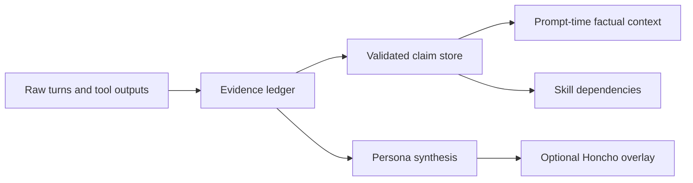
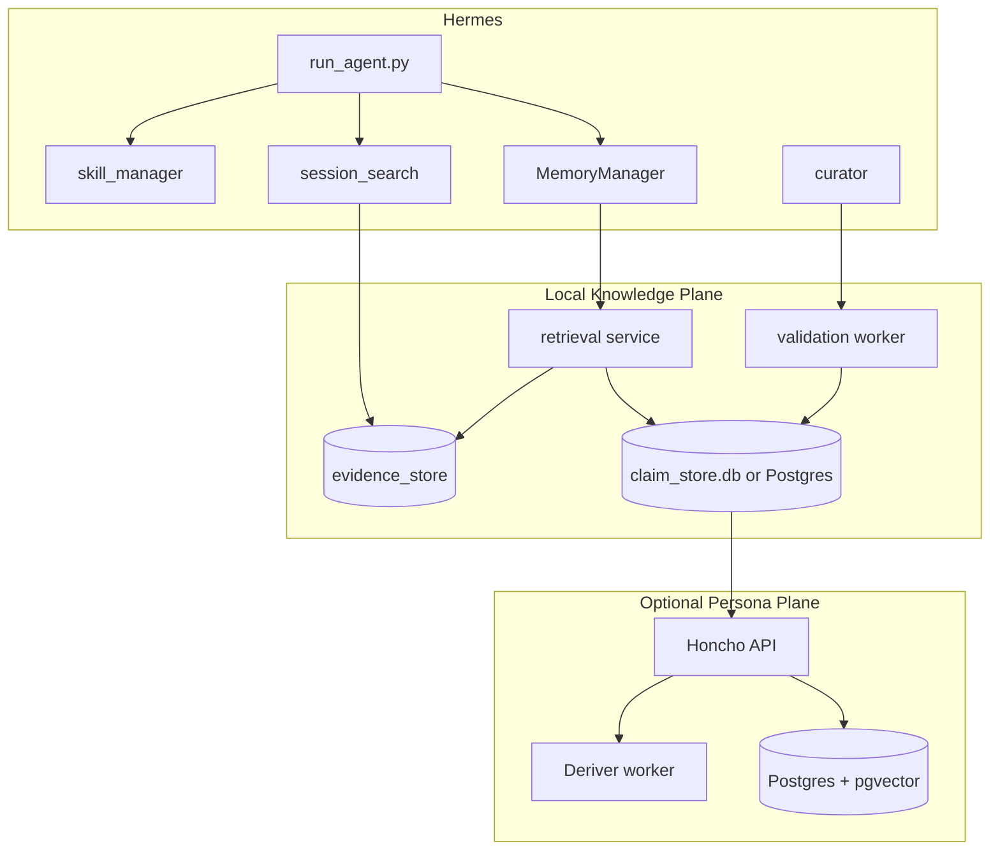

# Honcho and Holographic in Hermes Agent

## Executive summary

I audited the **Honcho** and **Holographic** memory-provider integrations in the uploaded `hermes-agent-main.zip` and cross-checked them against the current upstream repository and the providers’ official docs. The short conclusion is that the broad claims you were discussing earlier are **directionally accurate**, but they need sharpening. **Honcho** really is the strongest *user-model / persona* backend currently wired into Hermes: it exposes peer cards, peer/session context, semantic search, dialectic reasoning, conclusions, multi-profile peer separation, and a self-host path. **Holographic** really is the strongest *local inspectable structured-memory* backend in the repo: it is a local SQLite fact store with FTS5, entity linking, trust scores, optional HRR algebra, and zero mandatory network dependencies. However, **neither provider is a verified epistemic substrate** in the strict sense you care about. Honcho is still model-mediated and weak on provenance/confidence surfacing; Holographic is more inspectable, but its “facts” are still mostly free text with simple entity extraction and only lightweight trust/feedback semantics. citeturn5view9turn6view3turn0search0turn3view3turn3view4turn3view5

For a fork whose differentiator is **clear epistemics, verifiable claims, provenance, and maintainable long-term memory**, my recommendation is: **self-host/keep Holographic as the base layer, but extend it into a claims-and-evidence ledger; treat Honcho as optional and secondary, useful for persona synthesis and multi-peer modelling, but not as the source of truth.** Self-hosting Holographic is almost trivially worth it because “self-hosting” in practice means “run Hermes with a local SQLite file”. Self-hosting Honcho is worth it only if you explicitly want its multi-peer user modelling, session summaries, and reasoning surface badly enough to operate a **FastAPI service + PostgreSQL/pgvector + background worker** stack and accept continuing infrastructure and probably LLM-related costs. citeturn6view2turn5view0turn5view3turn7view2

The main architectural pressure point in Hermes is not either provider in isolation; it is Hermes’ **provider abstraction and prompt contract**. Hermes permits only **one external memory provider at a time**, labels injected provider recall as “authoritative reference data”, mirrors built-in memory writes as mostly unstructured strings, and has no first-class notion of **claim**, **evidence span**, **validation state**, **contradiction**, or **expiry**. That is the seam to fork on. citeturn6view3turn1view9turn1view8turn1view11

## Implementation inventory

The external-memory subsystem is organised around a `MemoryProvider` abstraction and a `MemoryManager` orchestration layer. The provider contract covers: availability checks, initialisation, a system-prompt block, prefetch, post-turn sync, provider-specific tools, memory-write mirroring, and lifecycle hooks such as turn start, session end, session switch, pre-compression extraction, and delegation observation. Hermes’ docs also state that only **one** external provider may be active at a time alongside the built-in `MEMORY.md` / `USER.md` system. citeturn1view8turn6view3

Within the repo, the relevant files for your fork are concentrated in a small number of places:

| Area | Key files in the repo | What they do now |
|---|---|---|
| Provider interface | `agent/memory_provider.py`, `agent/memory_manager.py` | Define the provider ABC, enforce one-external-provider-at-a-time, build provider prompt blocks, prefetch context, route provider tools, mirror built-in memory writes, and forward lifecycle hooks. |
| Honcho provider | `plugins/memory/honcho/__init__.py`, `client.py`, `session.py`, `plugin.yaml`, `README.md` | Wrap Honcho as a Hermes memory provider with five tools and mixed auto-injection / tool-driven recall modes. |
| Holographic provider | `plugins/memory/holographic/__init__.py`, `store.py`, `retrieval.py`, `holographic.py`, `plugin.yaml`, `README.md` | Implement a local SQLite fact store with FTS5, entity extraction, trust scoring, optional HRR vectors, and two tools. |
| Built-in memory and recall | `tools/memory_tool.py`, `tools/session_search_tool.py` | Maintain `MEMORY.md` / `USER.md` and search old transcripts via SQLite FTS5 plus LLM summarisation. |
| Procedural memory | `tools/skill_manager_tool.py`, `agent/curator.py` | Maintain skills as reusable procedures and run background skill review / archiving. |
| Integration points | `run_agent.py`, `agent/prompt_builder.py` | Activate providers, attach their tools, inject prefetched context into the live user message, sync completed turns, and instruct the model how to use memory/skills. |

This inventory is directly supported by the upstream repo files and Hermes’ own provider documentation. citeturn0search0turn3view0turn3view3turn3view4turn3view5turn6view3turn7view2

### Honcho in the repo

Hermes’ Honcho integration exposes **five** tools: `honcho_profile`, `honcho_search`, `honcho_reasoning`, `honcho_context`, and `honcho_conclude`. It supports three recall modes—`context`, `tools`, and `hybrid`—and the docs describe a two-layer recall model: a **base context layer** from Honcho peer/session context and a **dialectic supplement** driven by one to three `.chat()` reasoning passes governed by `dialecticCadence`, `dialecticDepth`, and `dialecticReasoningLevel`. Honcho configuration resolves through `$HERMES_HOME/honcho.json`, `~/.hermes/honcho.json`, then `~/.honcho/config.json`, with support for either an `apiKey` or a self-host `baseUrl`. Hermes’ docs also define Honcho’s multi-peer workspace model: one shared user peer, one AI peer per Hermes profile, configurable observation modes, and per-profile host blocks. citeturn7view2turn5view9turn0search0

In runtime terms, the Honcho adapter is not just a thin HTTP wrapper. It tracks turn cadence, pre-warms context, supports lazy session initialisation in tools-only mode, sanitises injected recall, chunks overlong messages, mirrors built-in user memory writes as Honcho conclusions, and uses a `HonchoSessionManager` to manage peers, sessions, message sync policy, semantic search, context fetches, session summaries, peer cards, and conclusions. The `plugin.yaml` declares the external dependency on `honcho-ai`, and Hermes’ `pyproject.toml` pins the optional extra to `honcho-ai==2.0.1`. citeturn0search0turn3view0turn5view7turn8view1

### Holographic in the repo

Hermes’ Holographic provider is materially simpler. It registers two tools: `fact_store` and `fact_feedback`. The docs and source describe it as a **local SQLite fact store** with **FTS5 full-text search**, **trust scoring**, **entity resolution**, and **HRR-based compositional retrieval** when NumPy is present. Configuration is profile-scoped under `config.yaml` in `plugins.hermes-memory-store`, with the main keys being `db_path`, `auto_extract`, `default_trust`, `min_trust_threshold`, and HRR settings such as `hrr_dim`. The provider is always “available” because it depends only on SQLite, with NumPy as an optional accelerator for the HRR path. citeturn6view2turn6view3turn3view3turn3view4turn3view5

The implementation stores free-text facts in a `facts` table, extracted entities in `entities`, fact–entity links in `fact_entities`, and category memory banks in `memory_banks`; it maintains an FTS5 virtual table and triggers for search indexing. Retrieval combines FTS5 candidates with Jaccard overlap, optional HRR similarity, trust weighting, and optional temporal decay. In addition to plain search, Holographic offers `probe`, `related`, `reason`, and `contradict` operations; the last compares pairs of facts with shared entities and low HRR similarity to surface possible contradictions. Hermes’ public docs characterise Holographic as best for “local-only memory with advanced retrieval, no external dependencies”. citeturn3view4turn3view5turn6view2turn6view3

## Claim accuracy and capability gaps

The claims about **Honcho** being Hermes’ strongest **user-model / persona** provider are substantially correct. Hermes’ own docs explicitly say Honcho adds dialectic reasoning, automatic user profiling, session summaries, multi-agent isolation, observation modes, conclusions, and semantic search over conclusions. The provider’s tool set mirrors that positioning: `honcho_profile` gives a peer card, `honcho_context` retrieves session and peer context, `honcho_search` returns raw semantic matches, `honcho_reasoning` asks Honcho for synthesised answers, and `honcho_conclude` writes persistent conclusions. If your benchmark is “which provider in Hermes most resembles an AI-native model of the user”, Honcho is the clear leader. citeturn5view9turn7view2turn0search0

The claims about **Holographic** being the best **structured local** option are also broadly correct, but they are easy to oversell. Holographic is local, inspectable, free, and significantly more structured than plain markdown memory because it stores rows with categories, tags, timestamps, trust scores, retrieval counts, helpfulness counts, entity links, and optional HRR vectors. It also supports richer retrieval patterns than simple semantic search, notably entity probing, multi-entity reasoning, and contradiction search. Those are real implementation features, not just marketing language. citeturn6view2turn6view3turn3view4turn3view5

Where both claims become inaccurate is when they are stretched into “verified knowledge substrate” territory. **Honcho does not provide first-class provenance, confidence, validation state, or bounded truth semantics inside Hermes.** Conclusions are persisted as strings; Hermes does not thread the richer metadata from built-in memory writes into Honcho conclusions yet, and the built-in recall injection still treats provider output as authoritative reference data at prompt time. That is excellent for continuity, but weak for epistemic hygiene. citeturn0search0turn1view9

**Holographic** is nearer to a rigorous substrate, but it still stops short. Its “facts” are mainly natural-language strings with categories and tags; entity extraction is regex-based; trust is a scalar adjusted by feedback; contradiction detection is heuristic; and there is no native schema for source transcript spans, tool-output provenance, confidence intervals, validation method, or supersession history. In other words, Holographic is **structured memory**, not yet **verified memory**. citeturn3view4turn3view5turn6view3

A precise feature-parity judgement is therefore:

| Dimension | Honcho in Hermes | Holographic in Hermes | Assessment |
|---|---|---|---|
| User-model / persona | Strong | Weak | Honcho wins decisively. |
| Structured claims | Partial | Partial-to-strong | Holographic is better, but still mostly free-text facts. |
| Provenance | Weak | Weak-to-partial | Timestamps exist in Holographic; neither adapter exposes rigorous evidence lineage. |
| Confidence / validation | Weak | Partial | Holographic has trust/feedback; Honcho does not surface explicit confidence in Hermes. |
| Retrieval sophistication | Strong | Strong | Different strengths: Honcho for semantic/persona reasoning; Holographic for local algebraic/entity retrieval. |
| Inspectability | Moderate | Strong | Holographic is inspectable on disk; Honcho indexing/reasoning mostly lives behind the service boundary. |
| Offline / air-gap feasibility | Conditional | Strong | Holographic is naturally offline; Honcho self-hosting is possible but operationally heavier. |
| Fit for an epistemic fork | Secondary | Primary base layer | Holographic is the better starting substrate. |

This verdict follows directly from Hermes’ provider docs and provider source files. citeturn5view9turn6view3turn7view2turn3view4turn3view5

## Self-hosting, licensing and cost

**Holographic** is the easy case. It is bundled inside the MIT-licensed Hermes repository, uses local SQLite storage, and requires no separate service. Its own docs call it “Local SQLite”, “Free”, and “Requires Nothing (SQLite is always available). NumPy optional for HRR algebra.” In practical terms, the operational cost is disk, negligible CPU for FTS5/SQL, and optional NumPy-backed HRR compute. Self-hosting Holographic is therefore not a separate platform decision; it is simply choosing the local provider and backing up `memory_store.db`. citeturn6view2turn5view8turn4search0

**Honcho** is more nuanced. Official Honcho docs say it is an open-source memory library with a managed service, and the Honcho repo says you can use `api.honcho.dev` or self-host the FastAPI server yourself. The self-hosting guide lists a local server, **PostgreSQL with pgvector**, Docker as an option, and a separate background worker (“Deriver”); production considerations include security, backups, monitoring, scaling the worker, database migrations, and LLM providers. The quickstart for the managed path requires an API key and says new tenants receive credits, while the repo also documents `http://localhost:8000` as the self-host target. Operationally, that means Honcho self-hosting removes vendor spend on the managed service but does **not** reduce the system to “just a local library”; it creates a proper service stack that you must deploy, monitor, back up, and feed with model capability. citeturn5view0turn5view1turn5view2turn5view3

Licensing is also asymmetric. Hermes itself is MIT-licensed. For Honcho, the public picture is mixed in a way that matters to a fork. The **Python SDK** repository (`honcho-ai`) is shown as **Apache-2.0**. However, the main Honcho server repository’s contribution guide says contributions are licensed under the same **AGPL-3.0** licence that covers the project. For a serious commercial or redistributed fork, you should therefore treat **Honcho licensing as a due-diligence item on the exact server artefact you deploy**, rather than assuming the SDK’s Apache licence covers the server. citeturn5view4turn5view5turn5view6

On “is self-hosting worth it?”, my answer differs by provider:

| Provider | Worth self-hosting? | Why |
|---|---|---|
| Holographic | Yes, by default | You already get local, private, inspectable storage; the extension cost is tiny and the control is high. |
| Honcho | Only conditionally | Worth it if you want multi-peer user modelling, persona synthesis, and session summaries enough to justify a separate service and licensing review. |

The associated risk picture is straightforward. Holographic’s main risks are **schema limitations, lack of provenance, and SQLite write/read bottlenecks at higher scale**. Honcho’s are **service complexity, external-model dependence, ambiguous licence expectations for the server, and the epistemic risk of treating model-generated synthesis as authoritative memory**. citeturn5view0turn5view3turn6view3turn1view9

## Pressure points in Hermes and fork decision

The first pressure point is Hermes’ **single-external-provider policy**. The docs say only one external memory provider can be active at a time, and `MemoryManager` is explicitly designed that way to avoid tool-schema bloat and conflicting memory backends. That design is sensible for a general-purpose upstream agent, but it is exactly the wrong shape for an epistemic fork, because you almost certainly want **at least two memory strata**: an evidence/claim substrate and a higher-level persona/model layer. citeturn6view3turn1view9

The second pressure point is the **prompt contract**. `build_memory_context_block()` in `agent/memory_manager.py` wraps prefetched provider recall in a fenced block whose system note says to treat it as “authoritative reference data”. That is acceptable for mechanical recall of local facts, but not for model-mediated outputs such as Honcho dialectic synthesis. If your fork wants verified memory, provider output must be typed as at least one of: **validated claim**, **working hypothesis**, **profile synthesis**, or **raw evidence**. Right now Hermes collapses those categories. citeturn1view9

The third pressure point is the **bridge from built-in memory to providers**. `tools/memory_tool.py` keeps `MEMORY.md` and `USER.md` as frozen prompt snapshots per session, mirrors writes out to providers, and performs injection/exfiltration scanning because those files are prompt-injected later. That is solid operational hygiene, but the bridge only passes string content plus shallow metadata; it does not create durable claim records with evidence spans, confidence, validation state, or supersession semantics. citeturn1view11turn1view9

The fourth pressure point is **session recall**. `session_search_tool.py` is good at finding prior sessions with SQLite FTS5 and summarising them through an auxiliary model, but it is still a recall surface, not a knowledge substrate. It creates human-readable summaries of prior sessions rather than stable evidence objects that can feed validation. A fork can turn this into a strength by extracting **evidence spans and candidate claims** from each summarised result rather than only returning prose. citeturn1view12

The fifth pressure point is that **skills and curator flows are decoupled from factual validation**. `skill_manager_tool.py` and `agent/curator.py` provide a strong procedural-memory system—create, patch, archive, pin, and review skills—but they do not currently bind skills to validated claims or evidence dependencies. That means procedures can drift without a first-class mechanism saying “this workflow depends on claim X, last validated on date Y”. citeturn1view13turn1view14turn1view10

Those pressure points lead to a clear fork decision:

The fork should make **claims** and **evidence** first-class, use **Holographic as the initial local substrate**, and treat **Honcho as an optional synthesis/persona overlay** rather than the canonical memory layer. That is the cleanest extension path and the most defensible technical argument for the fork. citeturn6view3turn5view9turn3view4turn3view5

## Recommended architecture and component breakdown

I recommend a **two-layer memory architecture** for the fork.

**Layer one** should be a **verified local claim substrate** built by extending Holographic. Keep the existing SQLite/FTS5/entity/HRR machinery, but introduce a new schema in which raw evidence and validated claims are distinct. **Layer two** should be an optional **persona synthesis layer**. In the short term this can be an adapter over Honcho. Later it could be a local synthesis service if you want full air-gap operation. The important design rule is: **persona synthesis may read from claims; it may not silently redefine them.** citeturn6view3turn5view9turn3view4turn3view5

A practical deployment, with no fixed cloud constraint, looks like this:

For storage, I would make the first release deliberately conservative. Use **SQLite + FTS5** in-process for the fork’s claim/evidence substrate, because Hermes already leans on SQLite, Holographic is already local SQLite, and your earliest wins come from **better schema and better semantics**, not from adding distributed systems. Keep **optional HRR** and add **optional vector search later** only if your retrieval quality requires it. When and if you need multi-process concurrency, team sharing, or very high evidence volume, move the same schema to **PostgreSQL + pgvector**. citeturn3view4turn6view2

A workable **claim schema** for the fork is:

| Field | Purpose |
|---|---|
| `claim_id` | Stable identifier |
| `claim_text` | Canonical human-readable statement |
| `subject` / `predicate` / `object_text` | Optional structured decomposition |
| `category` | `user_pref`, `project_fact`, `tool_fact`, `workflow_fact`, `persona_hypothesis`, `decision`, `environment_fact` |
| `scope` | Profile / workspace / repo / session / global |
| `status` | `candidate`, `validated`, `superseded`, `rejected`, `expired` |
| `confidence` | Numeric confidence estimate |
| `validation_state` | `unreviewed`, `self-consistent`, `user-confirmed`, `tool-confirmed`, `externally-verified` |
| `importance` | Prompt-time ranking hint |
| `source_provider` | `builtin`, `holographic`, `honcho`, `session_search`, `tool_output` |
| `source_session_id` | Source session |
| `source_turn_range` | Evidence location |
| `evidence_hash` | Idempotence / dedupe |
| `created_at`, `updated_at`, `last_validated_at`, `expires_at` | Lifecycle |
| `supersedes_claim_id` | Explicit replacement chain |
| `contradicts` | Linked contradictory claims |
| `tags` | Retrieval filters |
| `raw_payload` | Optional provider-native payload for audit |

Alongside that, create an **evidence table** keyed to exact session turns and tool outputs, and a **claim_evidence** link table. That gives you the missing epistemic primitive Holographic and Honcho both lack today: **fact claims tied to auditable evidence**. citeturn1view12turn3view4turn3view5turn5view9

For APIs, even if you keep things in-process at first, design the interface as if it could become a service:

| Endpoint / interface | Function |
|---|---|
| `record_turn(session_id, turn_id, user_msg, assistant_msg, tool_events)` | Append immutable evidence |
| `extract_claims(evidence_id)` | Turn evidence into candidate claims |
| `upsert_claim(claim)` | Idempotent claim write |
| `validate_claim(claim_id)` | Run contradiction / freshness / source checks |
| `query_claims(query, filters)` | Factual retrieval |
| `synthesise_profile(scope)` | Create persona/profile summaries from validated claims |
| `link_skill_claims(skill_name, claim_ids)` | Bind procedural memory to factual dependencies |

Your **consistency model** should be “append evidence synchronously, derive claims asynchronously, surface only validated/high-confidence claims as authoritative”. That prevents the system from injecting fresh but unvalidated summaries into the prompt as if they were facts. Honcho, if enabled, should ingest only **validated claims plus clearly-marked persona hypotheses**, not every raw turn. citeturn1view9turn5view3turn5view9

Authentication, backup, and monitoring can also stay proportionate. For a local-only first release, use file permissions and Hermes profile separation. If you split the knowledge plane into a service, use bearer tokens or mTLS between Hermes and the service. Back up SQLite with WAL-aware snapshots or move to PostgreSQL point-in-time recovery later. Monitor: provider latency, prefetch hit rate, contradiction volume, stale-claim count, validation failures, and Honcho worker lag if Honcho is enabled. citeturn5view0turn6view2

## Delivery roadmap, patch guidance and testing

The highest-value work is not to rewrite everything. It is to add a **claim/evidence layer** while preserving Hermes’ existing strengths. The roadmap below is the one I would actually execute.

| Priority | Change | Exact code locations | Patch-level guidance | Effort |
|---|---|---|---|---|
| P0 | Add claim/evidence abstractions | `agent/memory_provider.py`, `agent/memory_manager.py` | Extend the provider contract with typed recall strata (`validated_claims`, `persona_hypotheses`, `raw_evidence`) and allow a composite provider stack rather than one external provider only. | Medium |
| P1 | Stop calling all provider recall “authoritative” | `agent/memory_manager.py`, `run_agent.py` | Replace the single fenced memory block with typed fences; inject only validated claims as authoritative, and mark Honcho/profile synthesis as advisory. | Medium |
| P2 | Upgrade Holographic into claim store | `plugins/memory/holographic/store.py`, `retrieval.py`, `__init__.py` | Add `claims`, `evidence`, `claim_evidence`, and `claim_validation` tables; keep the current `facts` table as a compatibility view or migration source. | High |
| P3 | Record evidence on every completed turn | `run_agent.py`, `tools/session_search_tool.py` | On successful turn completion, persist an immutable evidence object before provider sync. Teach `session_search` to return evidence handles/spans as well as prose summaries. | Medium |
| P4 | Thread provenance through built-in memory writes | `tools/memory_tool.py`, `run_agent.py` | Expand `on_memory_write` metadata and persist source session, tool call, and origin into the claim store instead of only mirroring strings out. | Medium |
| P5 | Bind skills to facts | `tools/skill_manager_tool.py`, `agent/curator.py` | Add optional skill front-matter fields such as `depends_on_claims`, `last_fact_validation_at`, and let curator flag skills whose dependencies have gone stale. | Medium |
| P6 | Segregate Honcho as persona overlay | `plugins/memory/honcho/__init__.py`, `session.py` | Keep Honcho tools, but route Honcho outputs into `persona_hypotheses` and `profile_synthesis`; do not auto-upcast dialectic results into authoritative context. | Medium to High |
| P7 | Add validation pipeline | new `agent/claim_validator.py` and tests | Implement contradiction scans, expiry/freshness rules, user-confirmation marks, tool-confirmation marks, and supersession chains. | High |
| P8 | Add operator tooling | `hermes_cli/memory_setup.py`, new `hermes claims ...` CLI | Ship commands for inspect, validate, export, migrate, and diff memory state. | Medium |

These priorities align directly with the current responsibilities of the provider interface, the built-in memory tool, session search, skill tooling, and curator flow. citeturn1view8turn1view9turn1view11turn1view12turn1view13turn1view14

A concise migration and testing checklist looks like this:

- **Migrate built-in markdown memory** into candidate claims with low confidence and `source_provider='builtin'`. Effort: **Low**. citeturn1view11
- **Backfill session transcripts** into the evidence ledger before deriving claims. Effort: **Medium**. citeturn1view12
- **Migrate existing Holographic facts** into the new claims table, preserving trust scores and timestamps. Effort: **Medium**. citeturn3view4turn3view5
- **Keep Honcho read-only at first** and map its outputs to advisory profile synthesis until the claim substrate is stable. Effort: **Low**. citeturn5view9turn0search0
- **Add contract tests** for typed prompt injection, provenance retention, contradiction handling, and session-switch correctness. Effort: **Medium**. citeturn1view9turn7view2
- **Load-test Holographic contradiction scans and rebuild costs** at several fact-count tiers before broad rollout. Effort: **Medium**. citeturn3view4turn3view5
- **Run licensing review** on the exact Honcho server artefact before shipping self-hosted Honcho in production. Effort: **Low**, but legally important. citeturn5view4turn5view5

A comparative decision table for the major providers, focused on your fork question rather than generic product selection, is below. The alternatives other than Honcho and Holographic are shown at the level documented by Hermes’ own provider guide rather than a full implementation audit. citeturn8view1turn6view3

| Provider | Storage / deployment | Tools in Hermes | Distinctive strength | Best use in your fork |
|---|---|---:|---|---|
| **Honcho** | Cloud or self-hosted service | 5 | Dialectic user modelling, peer/session context, multi-profile peer separation | Optional persona layer |
| **Holographic** | Local SQLite | 2 | Inspectable local facts, trust scoring, HRR/entity retrieval | Primary verified substrate base |
| **Hindsight** | Cloud or local | 3 | Knowledge graph and reflect synthesis | Alternative future substrate if you prefer graph-first semantics |
| **Mem0** | Cloud | 3 | Server-side LLM extraction | Less attractive for a provenance-first fork |
| **Supermemory** | Cloud | 4 | Context fencing, session graph ingest, multi-container | Useful reference design for capture/fencing, not ideal truth layer |

### Recommendation

If the fork’s thesis is **“Hermes, but with a verified knowledge substrate”**, then the call is:

- **Self-host / retain Holographic** and extend it aggressively.
- **Do not make Honcho the truth layer.**
- **Optionally self-host Honcho later** as a separate persona-modelling plane if your product truly benefits from multi-peer/user-style synthesis.

That recommendation follows from the actual code, not just the repo marketing. Holographic is closest to something you can harden into a proper claim/evidence ledger. Honcho is more advanced at modelling a user, but it is also more operationally complex and more epistemically indirect. citeturn3view4turn3view5turn5view0turn5view3turn5view9turn6view3

### Open questions and limitations

This report fully audited the **Hermes-side adapters** for Honcho and Holographic and used official Hermes/Honcho documentation for deployment and positioning. It did **not** perform a ground-up code audit of the full external Honcho server implementation, so any production self-host plan should include a final review of the exact Honcho server release, its licence text, its database migrations, and its LLM-provider requirements. The alternative-provider comparison is intentionally lighter-weight than the Honcho/Holographic sections because your question centred on those two backends and the fork decision built on them. citeturn5view0turn5view3turn5view4turn5view5turn8view1